## 1. Устройство окружения

Цель: установить и проверить инструменты для работы с Clang/LLVM и визуализации CFG.

1.1 Обновление индекса пакетов

```bash
sudo apt update
```

– получает актуальные метаданные репозиториев.

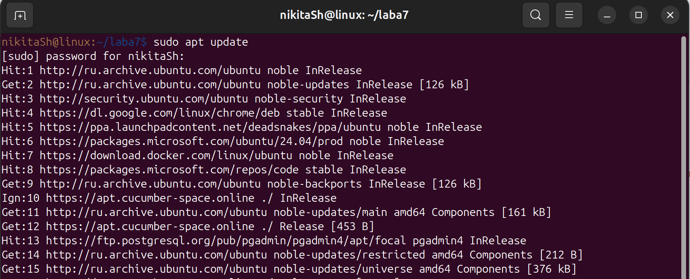

1.2 Установка Clang, LLVM, Opt и Graphviz

```bash
sudo apt install -y clang llvm opt graphviz
```

– `clang` для генерации AST и IR,
– `llvm` для библиотек и утилит (llc, llvm-as),
– `opt` для применения оптимизаций к IR,
– `graphviz` для конвертации DOT в изображения.

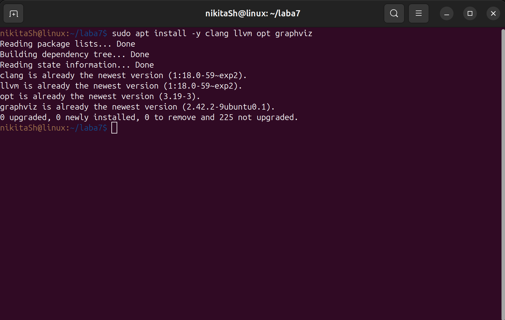

1.3 Проверка версий

```bash
clang --version
opt --version
dot -V
```

Убедился, что версии совместимы и без ошибок при запуске.

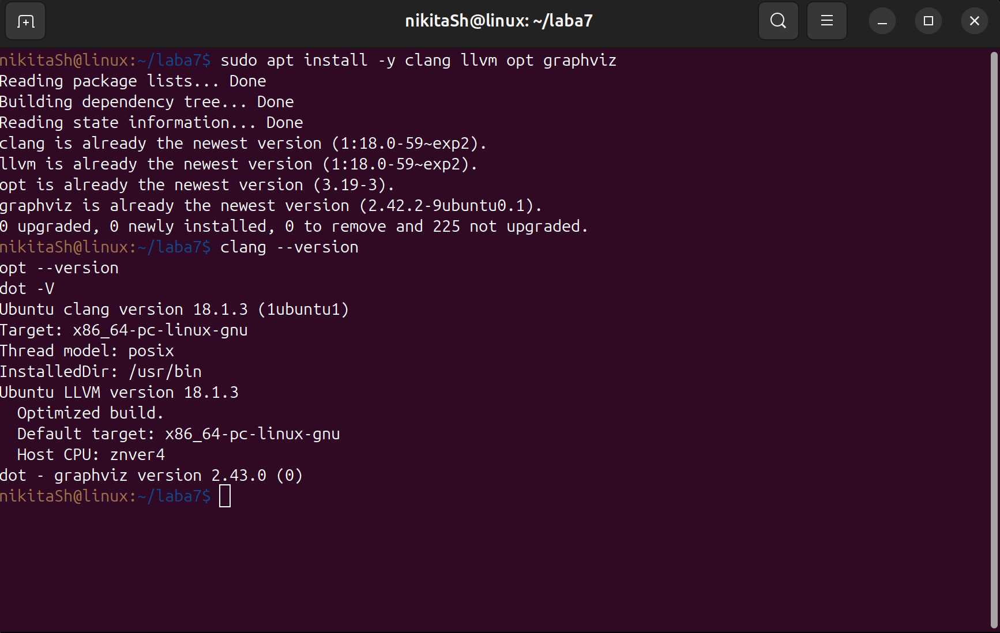


## 2. Исходный пример

Цель: получить простой код с константой и условием для демонстрации оптимизаций.

Файл `main.c`:

```c
#include <stdio.h>

const int LIMIT = 100;

int check(int x) {
    if (x < LIMIT)
        return x * 2;
    return x + LIMIT;
}

int main(void) {
    int value  = 42;
    int result = check(value);
    printf("Result = %d\n", result);
    return 0;
}
```

* `LIMIT` проверяется в оптимизациях `constprop`.
* `check` содержит две ветви (`<` и `>=`).
* В `main` фиксированное `value` позволяет предвычисления.

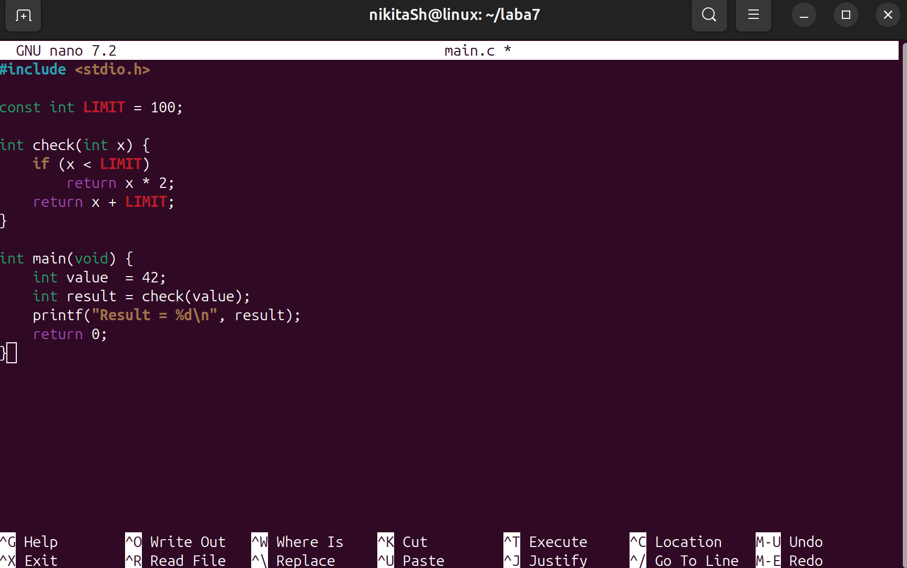


## 3. Извлечение AST

Цель: вывести синтаксическое дерево и определить ключевые узлы.

Команда:

```bash
clang -Xclang -ast-dump -fsyntax-only main.c
```

* `-Xclang -ast-dump` – дамп AST.
* `-fsyntax-only` – только проверка, без сборки.

Обращаем внимание на:

* `VarDecl LIMIT` с `IntegerLiteral 100`.
* `FunctionDecl` для `check` и `main`.
* `IfStmt` в `check`.
* `CallExpr` для `printf`.

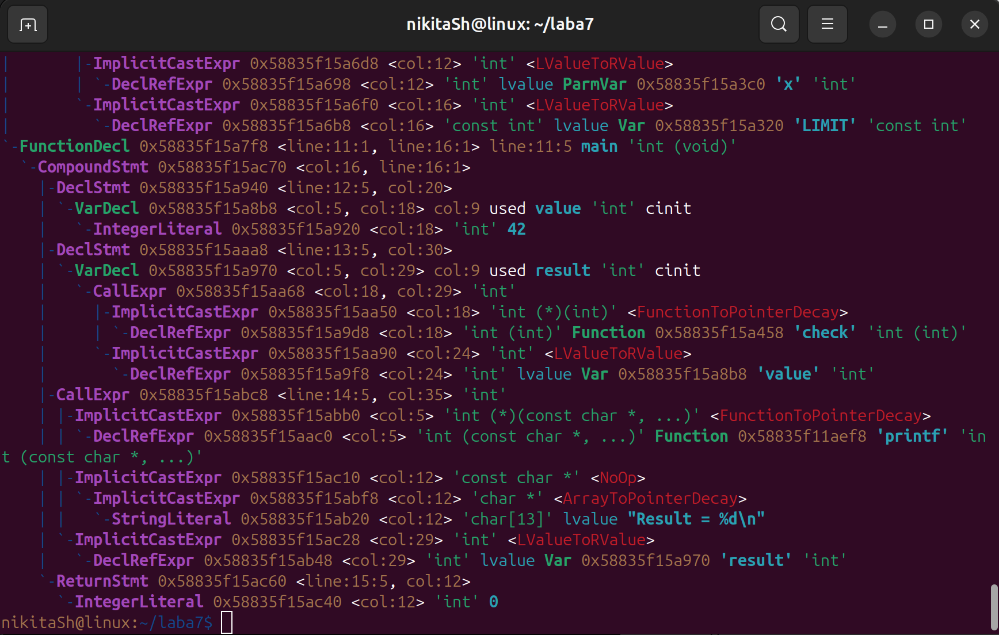


## 4. Создание LLVM IR

Цель: получить IR без оптимизаций и изучить структуру.

Команда:

```bash
clang -S -emit-llvm main.c -o main_unopt.ll
```

* `-S` – текстовый файл `.ll`.
* `-emit-llvm` – LLVM IR.

В файле:

* `entry` блоки с `alloca` для `value` и `result`.
* Инструкции `store` и `load`.
* Функция `@check` разбита на `if.then`, `if.else`, `if.end`.

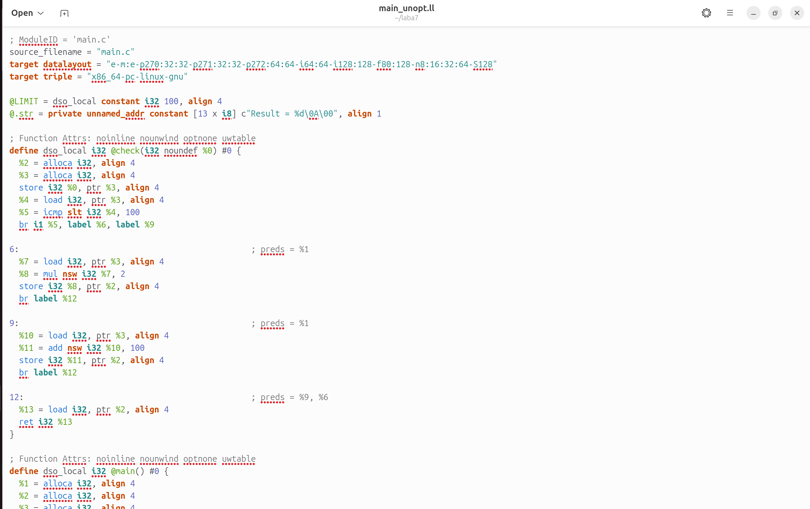


## 5. Проведение оптимизаций

### 5.1 Уровень O0

```bash
clang -O0 -S -emit-llvm main.c -o main_O0.ll
```

* IR примерно как в `main_unopt.ll`.
* Сохраняются все `alloca`, `load`, `store`.
* `@check` как отдельная функция.

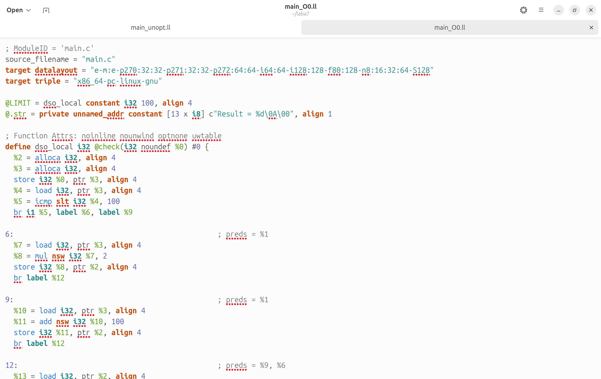

### 5.2 Уровень O2

```bash
clang -O2 -S -emit-llvm main.c -o main_O2.ll
```

Включает:

* `constprop` – подставляет `LIMIT=100`,
* `inline` – встраивает `check` в `main`,
* `mem2reg` – удаляет `alloca`, перевод в SSA,
* `instcombine`, `simplifycfg` и другие.

Результат:

1. Нет `alloca`, `load`, `store`.
2. `check` исчезает, её тело перенесено.
3. `printf` получает предвычисленное значение.

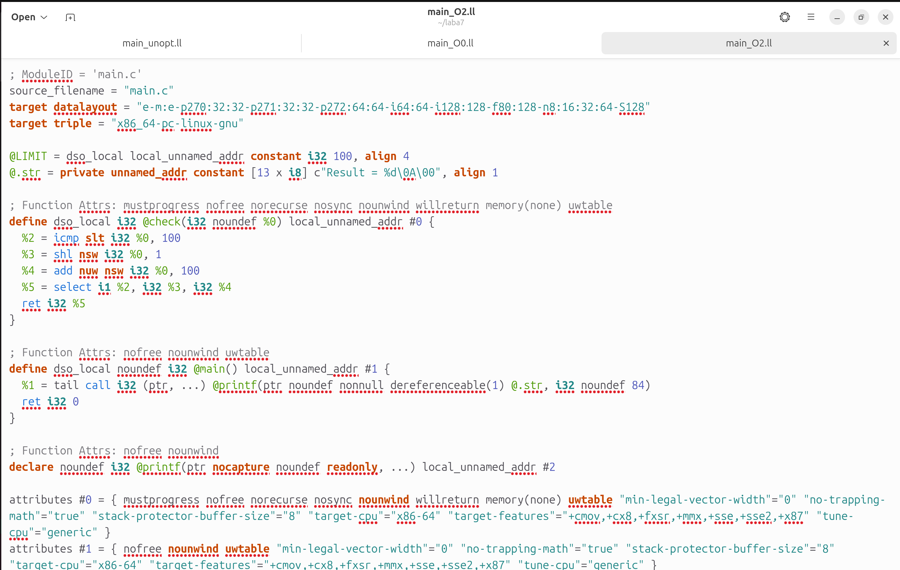

### 5.3 Сравнение O0 и O2

```bash
diff -u main_O0.ll main_O2.ll | head -n 25
```

* Удалены блоки операций памяти.
* Появился SSA‑код вместо `load`/`store`.
* Вызов `check` заменён арифметическими инструкциями.

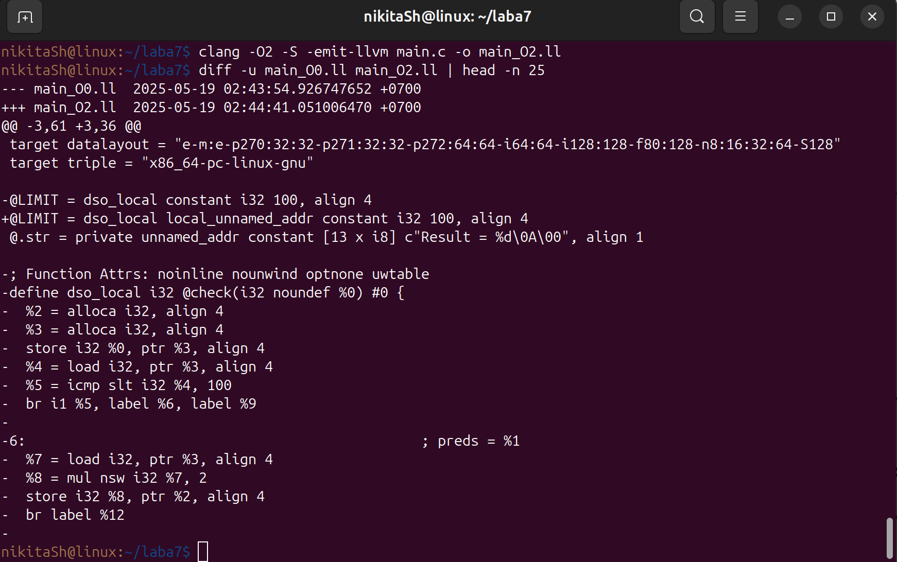


## 6. Составление и просмотр CFG

Цель: отобразить и проанализировать граф потока управления после оптимизаций.

1. Генерация DOT:

   ```bash
   opt -dot-cfg -disable-output main_O2.ll
   ```

   Создаётся скрытый файл `.main.dot`.

   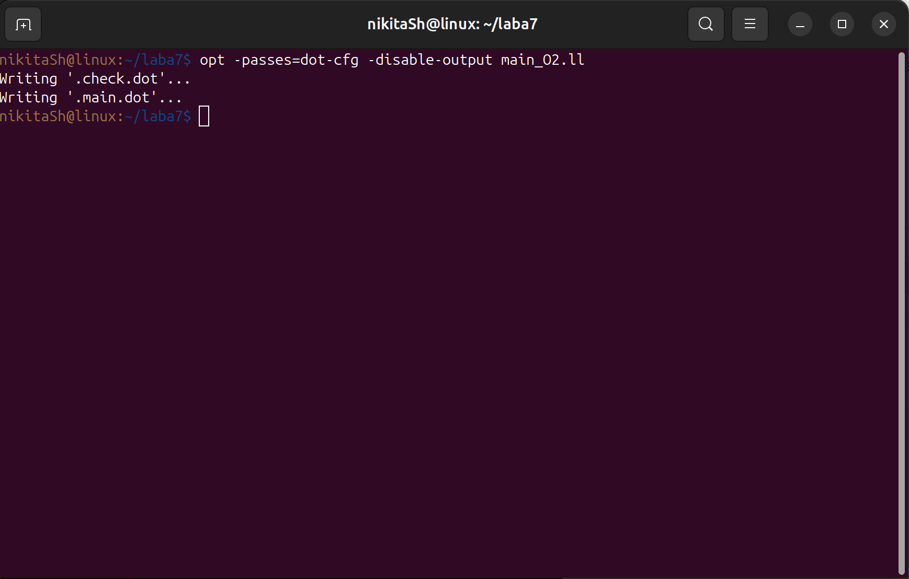

2. Конвертация в PNG и просмотр:

   ```bash
   dot -Tpng .main.dot -o cfg_main.png
   xdg-open cfg_main.png
   ```

   * Если условие статично известно, CFG сводится к одному блоку.
   * Иначе: два блока (true/false).

   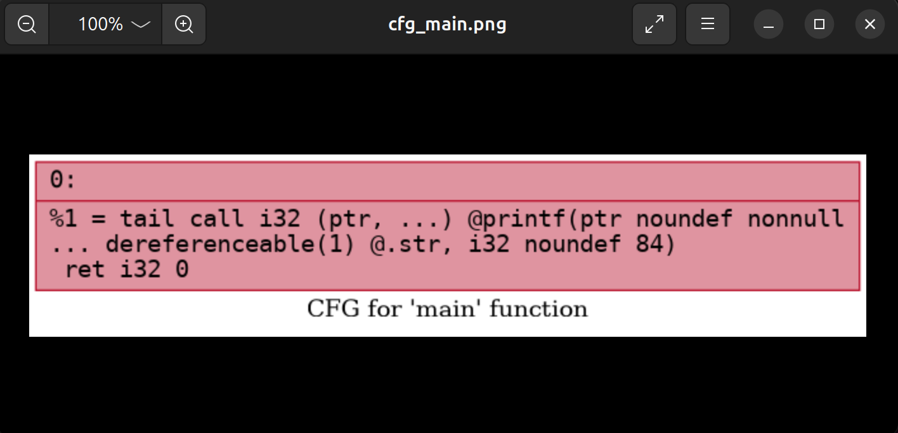


## 7. Основные выводы

1. AST показывает исходную синтаксическую структуру, полезен для статического анализа.
2. IR в режиме `-O0` содержит явные операции памяти, что затрудняет трансформации.
3. `-O2` выполняет `constprop`, `inline`, `mem2reg` и другие, приводя к компактному SSA.
4. CFG после оптимизаций упрощается, уменьшается количество блоков и ветвлений.


## 8. Дополнительное задание: исследование оптимизаций (вариант 5)

### 8.1 Отдельное constprop

```bash
clang -S -emit-llvm main.c -o temp.ll
opt -S --passes="correlated-propagation" temp.ll -o main_constprop.ll
```

В `main_constprop.ll`:

* `LIMIT` заменён на `100`.
* Сохраняются `alloca`, `lo\ad`.

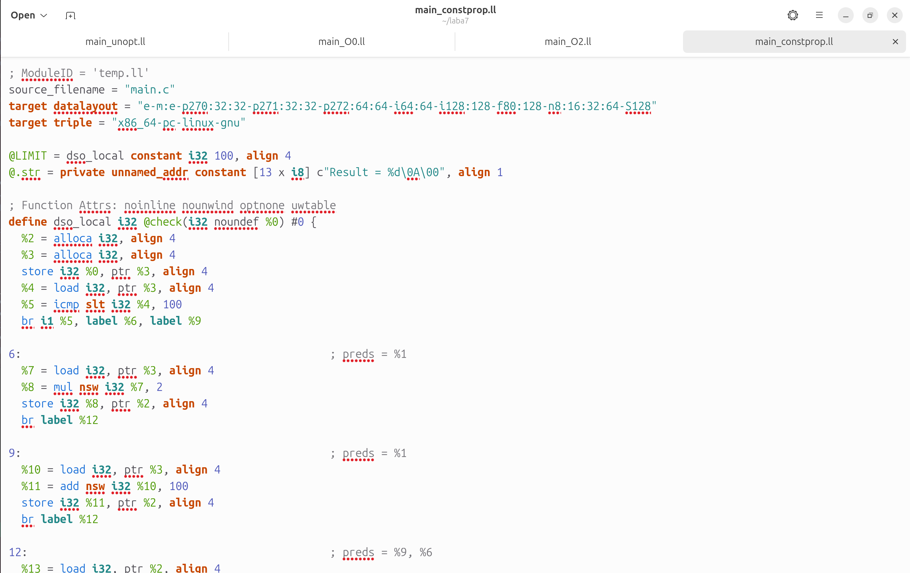

### 8.2 Сравнение с O2

```bash
diff -u main_constprop.ll main_O2.ll | sed -n '1,20p'
```

* `constprop` лишь подставляет константы.
* `-O2` добавляет `mem2reg`, `inline`, `simplifycfg`.

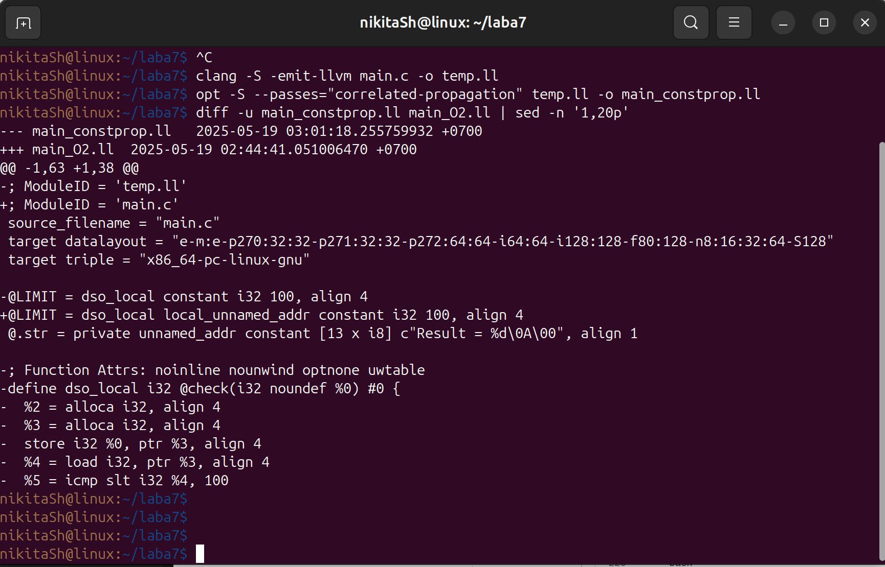

Вывод: `constprop` заменяет литералы, но для полного удаления памяти и ветвлений нужен комплекс оптимизаций `-O2`.
